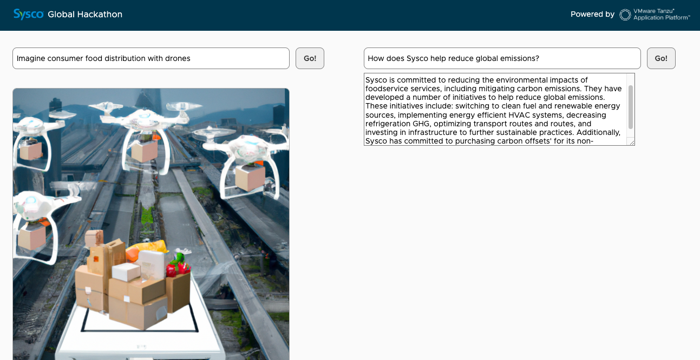

## OpenAI API Client



This is a simple [Spring Boot 3](https://spring.io/projects/spring-boot) app,
providing a user-friendly api-front end to query OpenAI. The application is structured
to run locally on your desktop, or in a containerized environment like Kubernetes.

### Deploy the app to TAP

``` tanzu apps workload apply -f config/workload.yaml```

that's it!!

This app relies on [servicebinding.io](https://servicebinding.io/)
to load the OpenAI API key.

As a developer, you don't have to deal with sensitive data: it's up to the app operator
to provide you with such things.

Note the use of `type: openai`. This value is used by
[a custom service binding processor implementation](src/main/java/com/vmware/tanzu/demos/dallecool/OpenAiBindingsPropertiesProcessor.java)
to set the `openai.key` property:

```java
public class OpenAiBindingsPropertiesProcessor implements BindingsPropertiesProcessor {
    public static final String TYPE = "openai";

    @Override
    public void process(Environment environment, Bindings bindings, Map<String, Object> properties) {
        bindings.filterBindings(TYPE).forEach(binding -> {
            properties.putIfAbsent("openai.key", binding.getSecret().get("key"));
        });
    }
}
```

Usually, you rely on service bindings to connect your app to some database, message broker, etc.
In this app, a custom service binding processor takes care of setting up the configuration for you.

Apply this configuration to the cluster:

```shell
kubectl -n $TAP_NS apply -f config/app-operator
```

The OpenAI API key is now available as a service binding. 

As a developer, deploy this app to TAP:

```shell
tanzu apps workload apply -f config/workload.yaml -n $TAP_NS
```

You're done!

Get the URL to access the app:

```shell
tanzu apps workload get dallecool -n $TAP_NS
```

```shell
🚢 Knative Services
   NAME        READY   URL
   dallecool   Ready   https://dallecool.dev.apps.corp.com
```

## License

Copyright &copy; 2023 [VMware, Inc. or its affiliates](https://vmware.com).

This project is licensed under the [Apache Software License version 2.0](https://www.apache.org/licenses/LICENSE-2.0).
